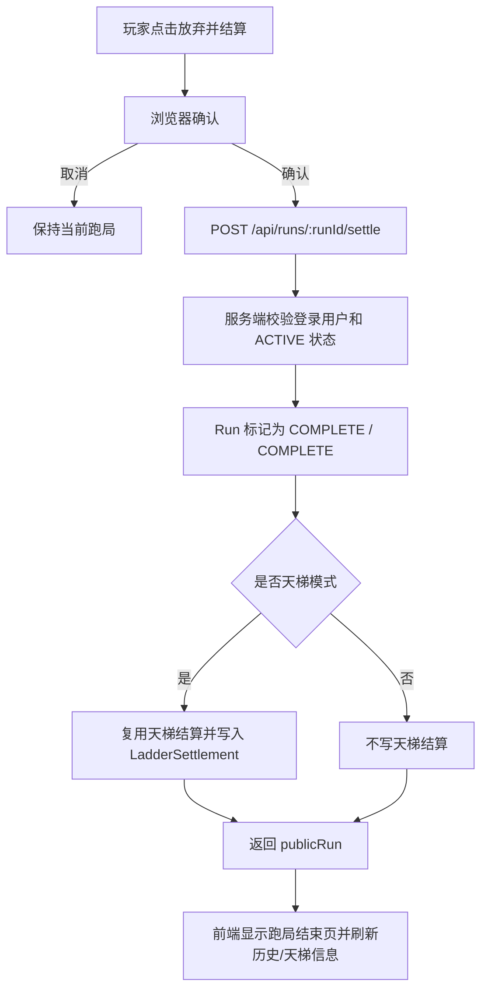

# 对局中放弃并按当前结算设计

## 背景

玩家希望在一局尚未自然达到 12 胜或 5 败时，可以主动停止当前跑局，并按照当前胜负记录进行结算。现有流程里，新开一局会把旧的进行中跑局标记为 `ABANDONED`，这类记录不会触发天梯积分结算，也不会进入现有的跑局结束页。新功能需要把“放弃”定义为一次主动结算，而不是简单废弃。

## 目标

- 玩家可以在当前跑局进行中主动放弃。
- 放弃时不再额外打一场战斗，也不额外增加失败次数。
- 结算使用放弃时已有的 `wins`、`losses`、`round`、装备、遗物和金币状态。
- 休闲模式放弃后进入已完成记录，可在历史里查看。
- 天梯模式放弃后按当前胜负立即生成天梯积分结算，并更新天梯档案。
- 已完成或已废弃跑局不能重复放弃结算。

## 非目标

- 不新增“撤销放弃”。
- 不改变自然战斗结束后的 `battle/finish` 结算规则。
- 不把新开一局自动废弃旧跑局的行为改成自动天梯结算。
- 不新增放弃惩罚；结算分数完全由现有胜负模型决定。

## 推荐方案

新增一个服务端接口：

`POST /api/runs/:runId/settle`

该接口只允许当前登录玩家结算自己的 `ACTIVE` 跑局。服务端读取跑局当前状态后：

1. 如果跑局不是 `ACTIVE`，返回 400，避免重复结算。
2. 将跑局更新为 `status: COMPLETE`、`phase: COMPLETE`。
3. 清空当前匹配对手信息，保留 `lastBattle` 作为最近一场战斗回放。
4. 不修改 `wins`、`losses`、`round`、`gold`、装备和遗物。
5. 如果跑局模式是 `LADDER`，复用现有 `settleLadderRun(userId, run.id, wins, losses)` 逻辑生成 `LadderSettlement`。
6. 返回 `publicRun`，让前端复用现有跑局结束展示。

前端在玩家拥有进行中跑局时提供“放弃并结算”入口。按钮使用危险样式，并在点击后弹出浏览器确认框，提示“将按当前胜负结算，不会额外增加失败”。确认后调用新接口，成功后显示现有“跑局结束”结果页。

## UI 入口

入口放在当前跑局主要操作区域里：

- 商店阶段：靠近“匹配”按钮，便于玩家在整理后主动收尾。
- 整备或已匹配阶段：靠近“匹配对手 / 开始战斗”按钮。
- 职业奖励、遗物选择、三选一阶段：不放在选择卡片内部，避免误触；可以通过顶部或当前页面底部的统一操作区进入。
- 战斗播放中不显示放弃按钮，因为战斗结果已经生成，应继续使用现有“继续”按钮结算该场战斗。
- 跑局已完成时不显示放弃按钮。

如果实现时发现统一入口更符合现有组件结构，可以优先放在 `Shell` 或当前跑局页面的固定操作区，但必须保持确认弹窗。

## 数据流

## 错误处理

- 未登录：沿用现有 401。
- 跑局不存在或不属于当前玩家：沿用现有 404。
- 跑局不是 `ACTIVE`：返回 400，错误文案说明“当前跑局已经结算或不可放弃”。
- 天梯结算已存在：接口应避免重复创建；由于只有 `ACTIVE` 跑局可进入，正常情况下不会发生。若数据异常，应让唯一约束错误暴露为可定位问题，而不是静默吞掉。

## 测试策略

服务端测试优先：

- 休闲跑局在任意当前胜负下调用放弃接口后变为 `COMPLETE`，胜负和回合不变。
- 天梯跑局放弃后生成 `ladderSettlement`，天梯档案按当前胜负更新。
- 已完成跑局再次调用放弃接口返回 400。

前端结构测试：

- 存在“放弃并结算”调用新接口。
- 战斗播放完成仍保留现有 `battle/finish` 流程。
- 跑局完成页继续显示天梯结算摘要。

## 验收标准

- 玩家可以在对局中主动放弃，并看到当前跑局结束页。
- 放弃不会额外增加失败次数。
- 休闲历史中该跑局显示为已完成，而不是已换狗。
- 天梯放弃会立即产生最近结算记录，并刷新天梯分数。
- `npm run build` 成功，并重新生成 `dist-click/DogFight-standalone.cmd`。
